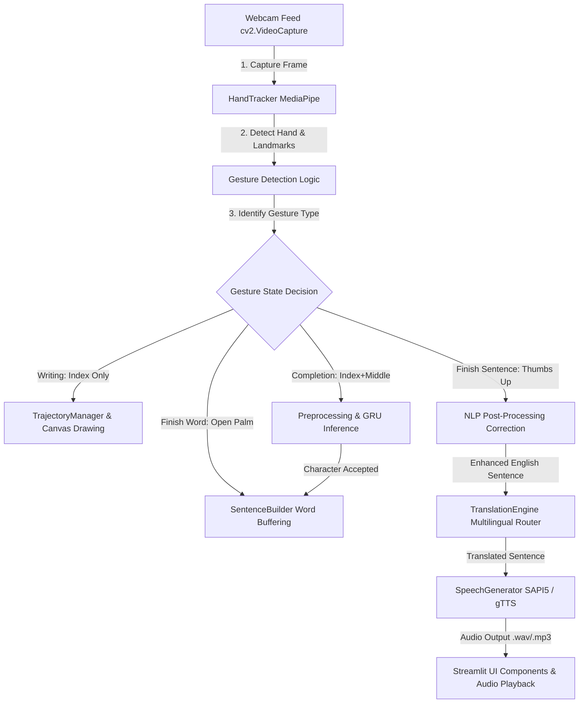

# Air-Writing Recognition System with Multilingual Speech Synthesis

An advanced, real-time gesture-recognition application that enables users to write characters in the air using their webcam. The system captures finger trajectories, smooths and resamples coordinate pathways, classifies characters using a deep Gated Recurrent Unit (GRU) neural network, applies NLP spell/grammar corrections, translates sentences into 12 target languages, and synthesizes natural speech output.

This project features a professional local **Streamlit Dashboard** alongside the classic OpenCV terminal-based UI.

---

## 🚀 Key Features

* **Phase 1-4: Hand Tracking & Trajectory Capture**: Powered by MediaPipe Hand Landmarking (Landmark 8 - Index Finger Tip).
* **Phase 5-7: Character Recognition & Spatial Overrules**: Resamples coordinate pathways to `(1, 64, 3)` sequences and runs inference via a trained GRU model in Keras. Automatically calibrates confidence scores using Temperature Scaling. Overrules circular ambiguities (CW/CCW Shoelace area checks for `0` vs `O`).
* **Phase 8: NLP Post-Processing**: Spell-checks compiled sentences using SymSpell, handles contractions, corrects subject-verb agreements, and restores capitalization and terminal punctuation.
* **Phase 9: Multilingual Translation**: Dual offline/online router supporting 12 languages: English, Hindi, Kannada, Tamil, Telugu, Malayalam, Marathi, French, German, Korean, Spanish, and Japanese.
* **Phase 10: Speech Synthesis**: Hybrid Text-to-Speech (TTS) engine using offline `pyttsx3` and online `gTTS` with background pygame music playback (pause, resume, stop, and play controls).
* **Phase 11: Streamlit Integration**: A premium, single-viewport 30/70 double-column dark-themed SaaS dashboard (using Poppins typography and a minimal color scheme) providing title, character recognition results, live text streams, AI enhancements, and translation settings on the left; and a dominant webcam view, compact playback audio controllers, and scrollable recent history cards on the right.

---

## 🎛️ Interactive Gesture Mapping

The system relies on MediaPipe Landmark detection to coordinate states without keyboard triggers.

| Gesture | Description / Trigger | Active Mode | Output State |
| :--- | :--- | :--- | :--- |
| **Index Finger Only Raised** | Draw strokes in the air | Writing Mode | Captures $(x,y,z)$ coordinates |
| **Index + Middle Raised** | Fold ring and pinky fingers | Character Completion | Preprocesses coordinates, runs GRU model, appends character |
| **Open Palm (All Raised)** | Keep all fingers extended | Word Boundary | Inserts space, completes word |
| **Thumbs Up (Thumb Raised)** | Fold index, middle, ring, pinky | Sentence Finalization | NLP corrections, translates, saves, auto-plays audio |
| **Open Fist (All Folded)** | Hold hand closed | Standby / Hover | Renders green pointer, pauses coordinate accumulation |

---

## 🛠️ Technology Stack

* **Front-end**: Streamlit (Dashboard GUI) / OpenCV (HUD Render Window)
* **Hand Tracking**: Google MediaPipe (Hand Landmarker API)
* **Sequence Classification**: TensorFlow / Keras (GRU Network)
* **NLP Processing**: SymSpell (minimum edit distance spelling)
* **Translation**: Deep Translator / Googletrans (Online) & Argos / MarianMT (Offline)
* **Audio Playback**: Pygame (Non-blocking music streaming)
* **TTS Engines**: pyttsx3 (SAPI5 COM Windows driver) & gTTS (Google Web Wrapper)

---

## 🏗️ Pipeline Architecture

The system flows through a modular, decoupled pipeline:



---

## 🧠 RNN Model Architectures & Performance Comparison (LSTM vs. GRU)

To classify finger trajectory coordinate sequences into character classes (Letters A-Z, a-z and Digits 0-9), the system supports training and evaluating recurrent neural network models built on Gated Recurrent Unit (GRU) and Long Short-Term Memory (LSTM) cells.

### 📐 Model Architecture
Both models share an identical structural layer sequence designed to handle coordinate paths dynamically:
1. **Masking Layer**: Masks padding timesteps (mask value = `0.0`) to accommodate variable coordinate sequences.
2. **First Recurrent Layer**: `LSTM(64, return_sequences=True)` / `GRU(64, return_sequences=True)` with `Dropout(0.2)`.
3. **Second Recurrent Layer**: `LSTM(64, return_sequences=False)` / `GRU(64, return_sequences=False)` with `Dropout(0.2)`.
4. **Dense Layer**: Fully-connected dense layer with `64` units and `ReLU` activation.
5. **Dropout Layer**: Regularization dropout of `0.2` to prevent overfitting.
6. **Output Dense Layer**: Dense layer with `Softmax` activation mapping across 62 target classes.

Both networks are compiled with the **Adam Optimizer** (learning rate default) and **Sparse Categorical Cross-Entropy** loss.

---

### 📊 Performance Summary
Below is a comparative breakdown of model performance on the preprocessed test dataset (Normalization Mode: `RESAMPLED`, shape: `(1, 64, 3)`):

| Metric | LSTM Model | GRU Model | Difference (LSTM - GRU) |
| :--- | :---: | :---: | :---: |
| **Test Accuracy** | 96.91% | 96.91% | 0.00% |
| **Test Precision** | 97.30% | 97.54% | -0.24% |
| **Test Recall** | 96.91% | 96.91% | 0.00% |
| **Test F1 Score** | 96.89% | 96.78% | +0.11% |
| **Trainable Parameters** | 58,622 | 46,398 | +12,224 (+26.3%) |

### 🔍 Key Insights & Deployment Recommendation
* **Footprint and Latency**: The **GRU model** uses fewer gates (2 gates vs LSTM's 3 gates), which reduces the parameter count by **12,224 weights (26.3% smaller footprint)**. This results in faster CPU inference and reduced runtime RAM consumption, making it ideal for standard edge device deployments.
* **Accuracy Trade-off**: The **LSTM model** achieves a slightly higher Test F1 Score of **96.89%** (vs 96.78% for GRU) due to its cell state's capacity to preserve long-term temporal dependencies.

---

## 📁 Workspace Directory Structure

```
Air_Writing_Recognition_System/
│
├── app.py                      # Main Streamlit Dashboard Entrypoint
├── requirements.txt            # System dependencies manifest
├── README.md                   # Main system handbook
│
├── src/                        # Modular Source Code Backend
│   ├── __init__.py             # Package constructor
│   ├── app.py                  # OpenCV CLI Entrypoint (Phase 1 Sandbox)
│   ├── data_collector.py       # Script to capture character dataset coordinates
│   ├── grammar_correction.py   # Subject-verb agreement & structural corrections
│   ├── hand_tracker.py         # MediaPipe hand skeletal landmark tracking logic
│   ├── language_manager.py     # Language mappings (codes, names, locales)
│   ├── nlp_pipeline.py         # Orchestrates spelling, contractions, grammar correction
│   ├── predict.py              # OpenCV CLI Sentence Inference Entrypoint with HUD
│   ├── preprocess.py           # Scaling, resample-interpolation, jitter smoothing
│   ├── punctuation.py          # Restoration of capitalizations & terminal markers
│   ├── sentence_builder.py     # Accumulates words & sentences from validated classes
│   ├── speech.py               # Non-blocking audio playback and hybrid TTS router
│   ├── spell_checker.py        # SymSpell-based spelling correction module
│   ├── suggestion_engine.py    # Predicts alternative word lists as letters are captured
│   ├── test_recognition.py     # Model accuracy evaluator on a dataset
│   ├── train.py                # Keras/TensorFlow GRU model trainer
│   ├── trajectory_manager.py   # Drawing state canvas and coordinate buffers
│   ├── translation.py          # Core translation route coordinator
│   ├── translation_cache.py    # In-memory & disk translation caching
│   ├── translator_factory.py   # Dual online/offline backend provider
│   └── word_builder.py         # Combines single letters with temporal timeout
│
├── docs/                       # Project Design and Reference Guidelines
│   ├── chapter3_proposed_system.md
│   ├── chapter4_dataset.md
│   ├── chapter5_system_design.md
│   ├── chapter6_system_implementation.md
│   ├── chapter7_results_evaluation.md
│   ├── chapter8_conclusion_future_enhancements.md
│   ├── dataset_documentation.md
│   ├── documentation.md
│   ├── lowercase_extension.md
│   ├── phase1_documentation.md
│   ├── phase4_documentation.md
│   ├── phase5_documentation.md
│   ├── preprocessing_documentation.md
│   ├── streamlit_architecture.md # Streamlit pipeline diagrams and lifecycles
│   └── viva_qa.md              # Project defense questions and answers
│
├── scratch/                    # Test Verification Scripts
│   ├── test_speech.py          # Unit tests verifying speech pause/play states
│   └── ...                     # System design helpers and scratch validations
│
├── data/                       # Dataset configurations and mapping keys
│   ├── processed/
│   │   ├── completeness_stats.json # Bounds for gesture completeness validation
│   │   └── label_mapping.json      # Class labels configuration for characters
│   └── raw/
│
└── models/                     # Deep learning model configurations
    ├── best_model.keras        # Main trained GRU classification model
    ├── gru_model.keras         
    ├── lstm_model.keras
    └── nllb/                   # Locally deployed offline translation models
```

---

## ⚙️ Setup and Deployment Guide

### Prerequisites

* **Operating System**: Windows 10/11 (required for SAPI5 `pyttsx3` offline audio drivers).
* **Python**: Python 3.9 - 3.11.
* **Hardware**: A connected USB or integrated webcam.

### Installation

1. Open PowerShell or Command Prompt in the project folder:
   ```bash
   cd d:\My____Projects\Air_Writing_Recognition_System
   ```

2. Create and activate a Python virtual environment:
   ```bash
   python -m venv venv
   .\venv\Scripts\activate
   ```

3. Install system dependencies:
   ```bash
   pip install -r requirements.txt
   ```

---

## 🏃 Running the Application

### Option A: Streamlit Professional GUI (Recommended)
Launch the modern SaaS dashboard in your default browser:
```bash
streamlit run app.py
```
This opens the app interface at `http://localhost:8501`.

### Option B: Classic OpenCV CLI Interface
Launch the real-time OpenCV window featuring the custom HUD dashboard:
```bash
python src/predict.py
```

#### Key Controls (OpenCV Interface):
* **[Space]**: Pause/Resume active audio playback.
* **[P / p]**: Replay latest audio.
* **[S / s]**: Stop audio.
* **[V / v]**: Toggle TTS Autoplay.
* **[C / c]**: Clear current buffers & canvas.
* **[Q / q]**: Quit.
* **[1 - 0]**: Direct hotkeys for translation target languages.
* **[L / l]**: Cycle through target languages.

---

## 🧪 Verification & Testing

Verify that your hardware, translation routing, and audio control modules work properly by executing the unit tests:
```bash
python scratch/test_speech.py
```
This runs 26 test cases verifying speech generation latency, translation caching pathways, language synthesis metrics, and correct toggle pause/resume states.
